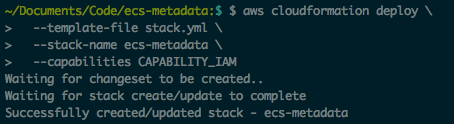
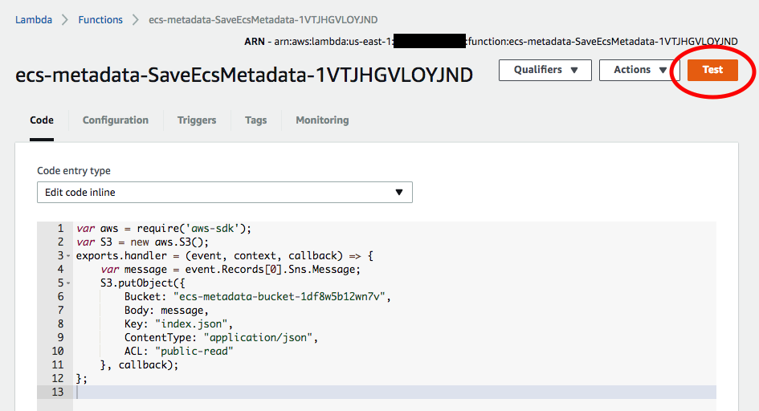
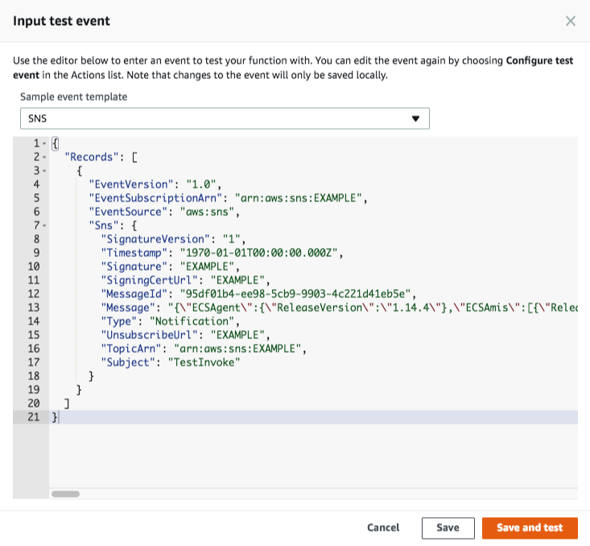
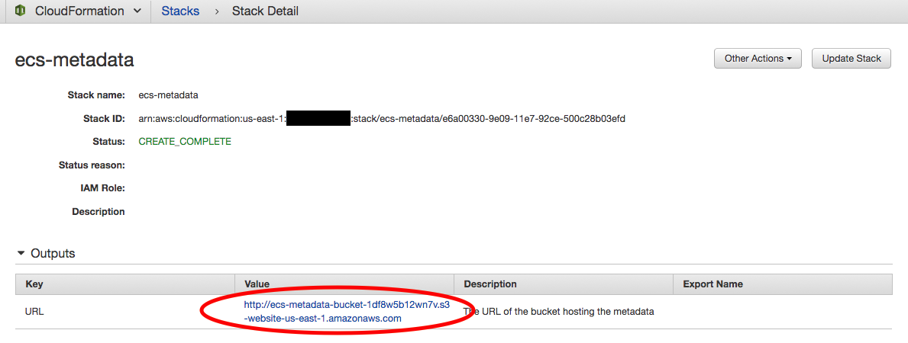
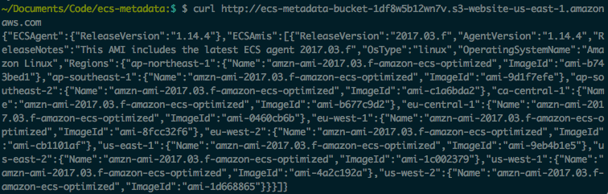

# ECS AMI Metadata Endpoint

# Deprecated!

_As of April 10, 2018 AWS has added an official method for fetching the latest ECS optimized AMI details programmatically, so it is no longer necessary to host your own endpoint to get the AMI details. [Read the release announcment](https://aws.amazon.com/about-aws/whats-new/2018/04/amazon-ecs-provides-ecs-optimized-ami-metadata-via-ssm-parameter/) for an explanation and links to the documentation._

## Why was this made?

AWS supplies a way to subscribe to an SNS topic that will notify you whenever there is an update to the official ECS AMI, however it can be challenging to figure out how to use this resource. This CloudFormation template demonstrates how to subscribe to the SNS topic, and connect a Lambda function to the topic to run logic in response to updates to the official ECS AMI. The Lambda function configured in this demo saves the ECS metadata into an S3 bucket that hosts a website endpoint that allows you to query the metadata whenever you want. This can be useful for infrastructure automation, particularly if you want to ensure that your infrastructure code is always using the most up to date version of the ECS AMI.

Here is an example of what the CloudFormation template deploys:

http://ecs-metadata.s3-website-us-east-1.amazonaws.com/

_Do not use the above URL in your application. It is not an official AWS resource, and there are no guarantees that it will be available forever, or that it is secure. Instead use this CloudFormation template to launch your own endpoint and run it securely for yourself._

## Installation

__1. Launch the CloudFormation stack on your account__

```bash
aws cloudformation deploy \
  --template-file stack.yml \
  --stack-name ecs-metadata \
  --capabilities CAPABILITY_IAM
```



__2. Bootstrap the Bucket__

Because the Lambda only gets invoked when there is an update to the metadata your endpoint will start out with no data, unless you manually bootstrap it with the current metadata. You can copy the metadata from the example endpoint above, or for extra security manually construct the metadata yourself based on the [AMI info in the official documentation](http://docs.aws.amazon.com/AmazonECS/latest/developerguide/ecs-optimized_AMI.html).

Go to the Lambda dashboard, select the lambda function that was created, and click the "Test" button.



The first time you click it a dialog will appear asking you to configure the Test Event. Choose the "SNS" template, and substitute the `message` property with a properly escaped JSON document.



Here is a plaintext example of what the test event should look like. Note that the JSON document embedded in the `message` property needs all its quotes escaped. You can use an online tool such as [the addslashes() function](https://www.tools4noobs.com/online_php_functions/addslashes/) to do this easily.

```json
{
  "Records": [
    {
      "EventVersion": "1.0",
      "EventSubscriptionArn": "arn:aws:sns:EXAMPLE",
      "EventSource": "aws:sns",
      "Sns": {
        "SignatureVersion": "1",
        "Timestamp": "1970-01-01T00:00:00.000Z",
        "Signature": "EXAMPLE",
        "SigningCertUrl": "EXAMPLE",
        "MessageId": "95df01b4-ee98-5cb9-9903-4c221d41eb5e",
        "Message": "{\"ECSAgent\":{\"ReleaseVersion\":\"1.14.4\"},\"ECSAmis\":[{\"ReleaseVersion\":\"2017.03.f\",\"AgentVersion\":\"1.14.4\",\"ReleaseNotes\":\"This AMI includes the latest ECS agent 2017.03.f\",\"OsType\":\"linux\",\"OperatingSystemName\":\"Amazon Linux\",\"Regions\":{\"ap-northeast-1\":{\"Name\":\"amzn-ami-2017.03.f-amazon-ecs-optimized\",\"ImageId\":\"ami-b743bed1\"},\"ap-southeast-1\":{\"Name\":\"amzn-ami-2017.03.f-amazon-ecs-optimized\",\"ImageId\":\"ami-9d1f7efe\"},\"ap-southeast-2\":{\"Name\":\"amzn-ami-2017.03.f-amazon-ecs-optimized\",\"ImageId\":\"ami-c1a6bda2\"},\"ca-central-1\":{\"Name\":\"amzn-ami-2017.03.f-amazon-ecs-optimized\",\"ImageId\":\"ami-b677c9d2\"},\"eu-central-1\":{\"Name\":\"amzn-ami-2017.03.f-amazon-ecs-optimized\",\"ImageId\":\"ami-0460cb6b\"},\"eu-west-1\":{\"Name\":\"amzn-ami-2017.03.f-amazon-ecs-optimized\",\"ImageId\":\"ami-8fcc32f6\"},\"eu-west-2\":{\"Name\":\"amzn-ami-2017.03.f-amazon-ecs-optimized\",\"ImageId\":\"ami-cb1101af\"},\"us-east-1\":{\"Name\":\"amzn-ami-2017.03.f-amazon-ecs-optimized\",\"ImageId\":\"ami-9eb4b1e5\"},\"us-east-2\":{\"Name\":\"amzn-ami-2017.03.f-amazon-ecs-optimized\",\"ImageId\":\"ami-1c002379\"},\"us-west-1\":{\"Name\":\"amzn-ami-2017.03.f-amazon-ecs-optimized\",\"ImageId\":\"ami-4a2c192a\"},\"us-west-2\":{\"Name\":\"amzn-ami-2017.03.f-amazon-ecs-optimized\",\"ImageId\":\"ami-1d668865\"}}}]}",
        "Type": "Notification",
        "UnsubscribeUrl": "EXAMPLE",
        "TopicArn": "arn:aws:sns:EXAMPLE",
        "Subject": "TestInvoke"
      }
    }
  ]
}
```

After you configure the test event click "Save and Test". This will invoke the Lambda function as if it had been called by the ECS metadata SNS topic, and save the metadata in your S3 bucket.

__3. Access the metadata in the bucket.__

Return to the CloudFormation stack that you just created and check the outputs for the stack. There will be an output called "URL" which is the public URL of the bucket containing the metadata. Access this URL as you see fit!





